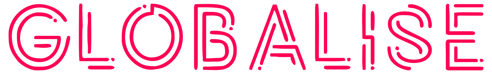

<!-- ---
hide:
  - toc
--- -->

# Home 

<!--  -->

  

The aim of the [GLOBALISE project](https://globalise.huygens.knaw.nl/) is to develop an online infrastructure that unlocks the key series of VOC documents and reports for advanced new research methods. On this Docs page, we provide background documentation about the project. Currently limited to information about the ethics policy, we will soon extend the information provided here with documentation about the GLOBALISE ontology, source corpus, and guiding principles for the design and development of the online interfaces, among others. We welcome your feedback through our [contact form](https://globalise.huygens.knaw.nl/contact-us/).

## Table of Contents

### GLOBALISE Guiding Principles

- [Mission and Research Themes](mission/mission_researchthemes.md)
- [Guiding Key Research Questions](mission/themes-questions.md)

### GLOBALISE Ethics Guidelines

- [Ethics Policy](ethics/policy.md)
<!-- - [Ethical Review of Work Processes](ethics/workflow-review.md) -->
    

