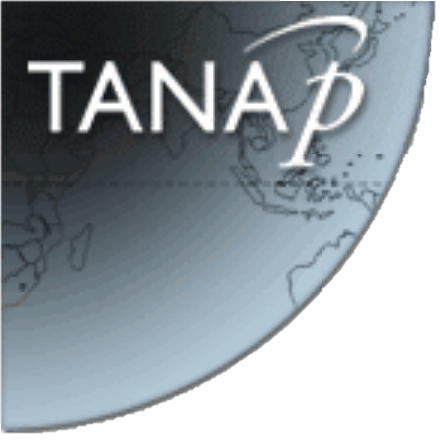

<!-- ---
hide:
  - toc
--- -->

# Home 

<!--  -->

    
    

## Preserving TANAP’s Legacy

On this website, the [GLOBALISE project](https://globalise.huygens.knaw.nl/) presents a selection of materials that were once available on the TANAP website, ensuring continued access to important resources for researchers and the public. This website provides the following resources:

- [Archival inventories of VOC-related collections worldwide](archival-inventories/index.md)
- [TANAP index and establishment reconstructions, listing VOC archival materials related to specific establishments](tanap-index-establishment-reconstructions/index.md)
- [Cape of Good Hope transcriptions, a collection of manually transcribed documents from the Orphan Chamber and Council of Policy](cape-transcriptions/index.md)
- [A Web Archive snapshot of the TANAP website from 2018 for local browsing](https://github.com/globalise-huygens/tanap.docs.globalise.huygens.knaw.nl/blob/main/docs/static/tanap-website.zip) (c.65 MB)

## TANAP

TANAP (Towards a New Age of Partnership) was an international initiative launched in the late 1990s to preserve and improve access to the archives of the Dutch East India Company (VOC). Led by the National Archives of the Netherlands and Leiden University, TANAP collaborated with archival institutions across Asia and South Africa to safeguard this shared historical heritage and support new research. The programme worked to provide scholarships, support archival training, and promote international cooperation through workshops and conferences. It also contributed to the successful nomination of the VOC archives to UNESCO’s Memory of the World Register.

Although the original TANAP website is no longer online, its objectives remain relevant. As the GLOBALISE project continues efforts to enhance access to VOC archives and develop new research tools, we have made these materials available here to ensure that TANAP’s contributions remain accessible.
